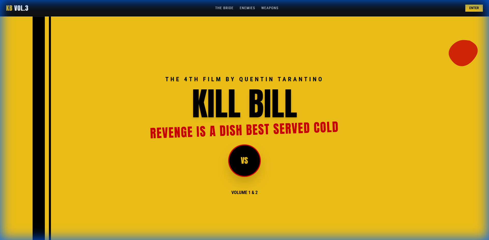
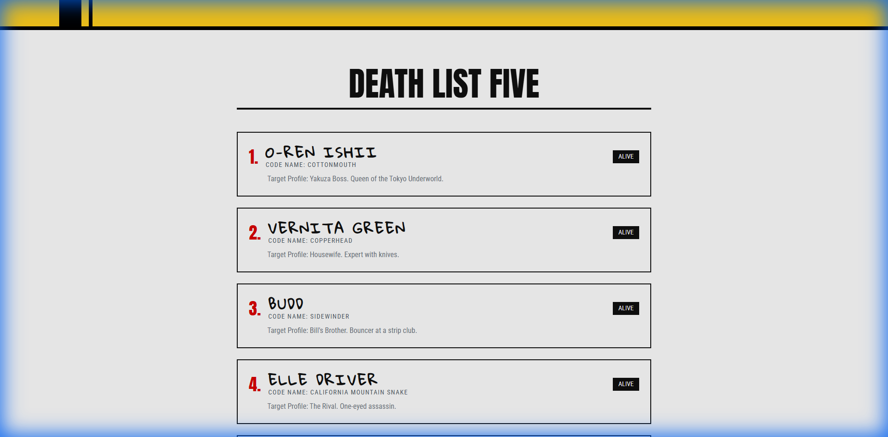
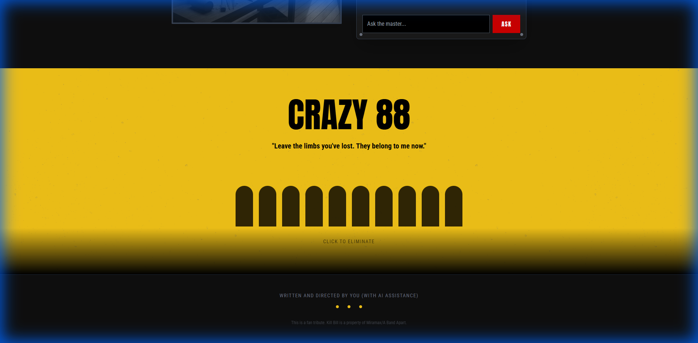
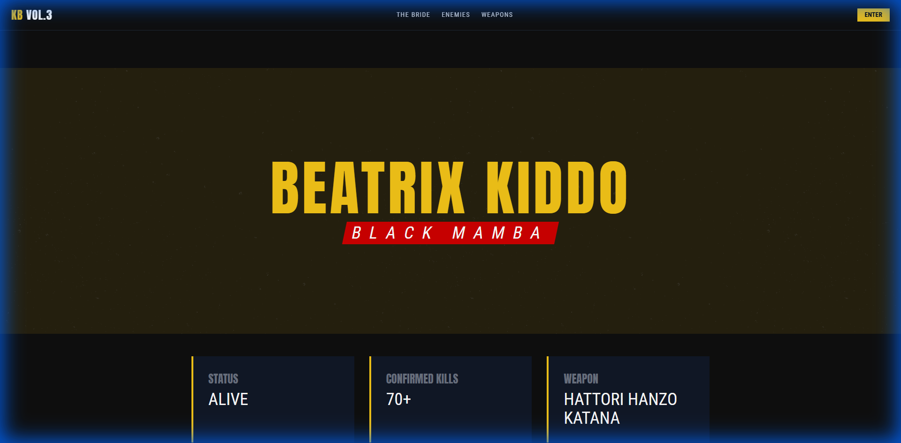
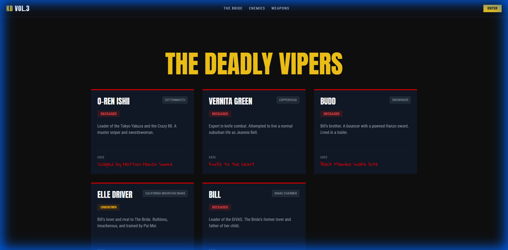
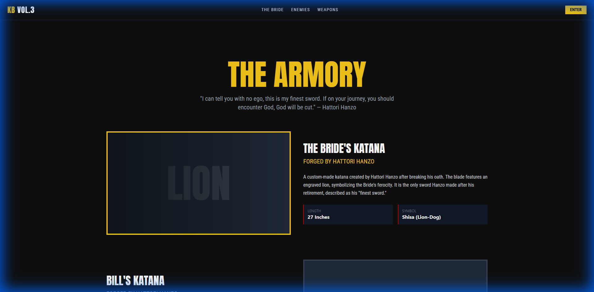

# Kill Bill: Vol. 3 - The Interface

A cinematic, immersive web experience inspired by Quentin Tarantino's *Kill Bill* franchise. This project serves as a conceptual "Volume 3" interface, blending high-impact visuals, interactive elements, and AI-powered features.

## Features

-   **Cinematic Design**: A visually striking interface using the iconic yellow, black, and blood-red color palette.
-   **Interactive Elements**:
    -   **Crazy 88 Section**: Click to "eliminate" silhouettes with a dynamic cutting animation.
    -   **Hanzo's Dojo**: AI-powered chat interface with Hattori Hanzo (powered by Google Gemini).
-   **Detailed Lore Pages**:
    -   **The Bride**: Profile of Beatrix Kiddo with stats and backstory.
    -   **Enemies**: Roster of the Deadly Viper Assassination Squad.
    -   **Weapons**: Showcase of legendary Hattori Hanzo steel.
-   **Responsive Layout**: Optimized for both desktop and mobile viewing.

## Screenshots

### Main Interface
| Hero Section | Death List |
|:---:|:---:|
|  |  |

| Hanzo Dojo | Crazy 88 (Interactive) |
|:---:|:---:|
|  |  |

### Detailed Pages
| The Bride | Enemies |
|:---:|:---:|
|  |  |

| Weapons | |
|:---:|:---:|
|  | |

## Run Locally

**Prerequisites:** Node.js

1.  **Clone the repository:**
    ```bash
    git clone <repository-url>
    cd kill-bill-landing
    ```

2.  **Install dependencies:**
    ```bash
    npm install
    ```

3.  **Configure Environment Variables:**
    -   Create a `.env.local` file in the root directory.
    -   Add your Google Gemini API key:
        ```
        GEMINI_API_KEY=your_api_key_here
        ```

4.  **Start the development server:**
    ```bash
    npm run dev
    ```

5.  **Open your browser:**
    Navigate to `http://localhost:3000` (or the port shown in your terminal).

## Tech Stack

-   **Framework**: React + Vite
-   **Styling**: Tailwind CSS
-   **Routing**: React Router DOM
-   **AI**: Google Gemini API
-   **Fonts**: Anton, Gloria Hallelujah, Roboto Condensed
